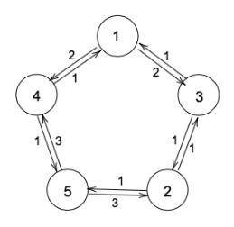

# Hirschberg–Sinclair algorithm(HS) 

This an implementation of the [HS](https://en.wikipedia.org/wiki/Hirschberg%E2%80%93Sinclair_algorithm) _leader election_ algorihtm 
in an asynchronous ring network of processes with `uniqure non-zero integer ids` to find a leader.

## Run
The code is written with **Python v3.8** but any other `v3.*` of python would run the program.
You can run the program in any **IDE** or **Terminal**:

```shell
>> python3 ./HS.py
```

## Input
after running the code you can define the network topology like below:



Type the number of nodes `n` on the first line, on each of the other `n` lines 
type a tuple with the first number representing the _i'th nodes UID_ and the second number 
representing the _channels delay_

```shell
5 
1 2
3 1
2 1
5 3
4 1
```

## Output 

Each node(process or thread) starts probing until a leader is elected:

```shell
.
.
.
08:29:48 PM   1 : sending a token of type  ANNOUNCEMENT  from  5  in  ANTICLOCKWISE direction
08:29:50 PM   4 : a token of type  ANNOUNCEMENT  received from  5  in  ANTICLOCKWISE  direction
08:29:50 PM   1 : leader is  5
08:29:50 PM   4 : sending a token of type  ANNOUNCEMENT  from  5  in  ANTICLOCKWISE direction
08:29:50 PM   process  1  stopping...
08:29:51 PM   5 : a token of type  ANNOUNCEMENT  received from  5  in  ANTICLOCKWISE  direction
08:29:51 PM   4 : leader is  5
08:29:51 PM   process  4  stopping...
08:29:51 PM   election completed with process  5  elected as the leader
08:29:51 PM   process  5  stopping...
08:29:56 PM Exiting program...
```
